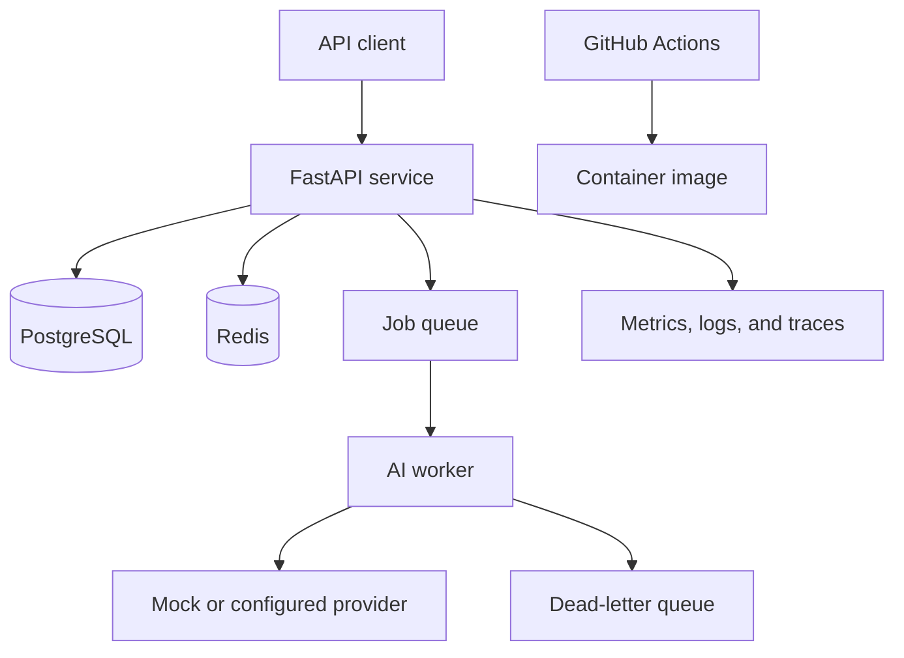

# AgentCloud API

A cloud-oriented asynchronous AI service demonstrating reliable backend patterns for queued inference workloads.

> **Status:** Active development. Implementation and test evidence will follow after local verification.

## Project goals

- Authenticated, tenant-scoped API clients
- Asynchronous jobs and independent workers
- Database-backed idempotency
- Redis-compatible queues and dead-letter handling
- Retry and backoff policies
- Provider-agnostic inference with deterministic mock mode
- Rate limiting and usage accounting
- Health, readiness, metrics, logs, and traces
- Container deployment guidance for AWS-oriented environments

## Planned architecture

## Scope and cost safety

The project will document cloud deployment, but no paid cloud resources will be created during the local build. Performance numbers will be reported only when supported by captured test evidence.

## Publication plan

The completed repository is expected to include migrations, tests, Docker Compose, CI, OpenAPI examples, a load-test script, an operational runbook, security notes, and a verification evidence table. Source will be pushed after the service and worker pass their verification gate.
