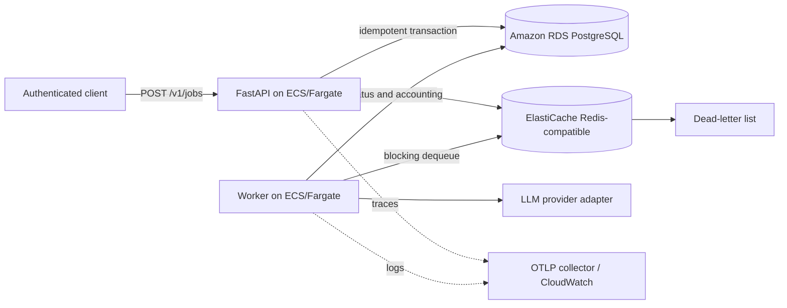

# Architecture

The API persists a job before enqueueing its identifier. A uniqueness constraint on
`(client_id, idempotency_key)` prevents duplicate jobs during concurrent submissions.
Workers lock a job row, transition its state, call a provider adapter, and persist result,
token counts, and estimated cost. Failures use exponential backoff before entering the
dead-letter list after the configured attempt limit.

## AWS-oriented mapping

- API and worker: separate ECS services on Fargate, private subnets, least-privilege task roles.
- Ingress: Application Load Balancer with TLS via ACM and optional AWS WAF.
- Database: RDS PostgreSQL with Multi-AZ, encryption, backups, and RDS Proxy where justified.
- Queue/cache: ElastiCache for Redis-compatible engines with encryption and authentication.
- Secrets: Secrets Manager injected into tasks; never baked into images.
- Telemetry: ADOT sidecar/collector exporting traces and metrics to an approved backend.
- Images: ECR with immutable tags and vulnerability scanning.

Redis lists keep this demonstration compact, but queue publication and database commit are
not atomic. A production evolution should use a transactional outbox/relay or a managed
queue such as SQS, with a DLQ and visibility timeouts.

